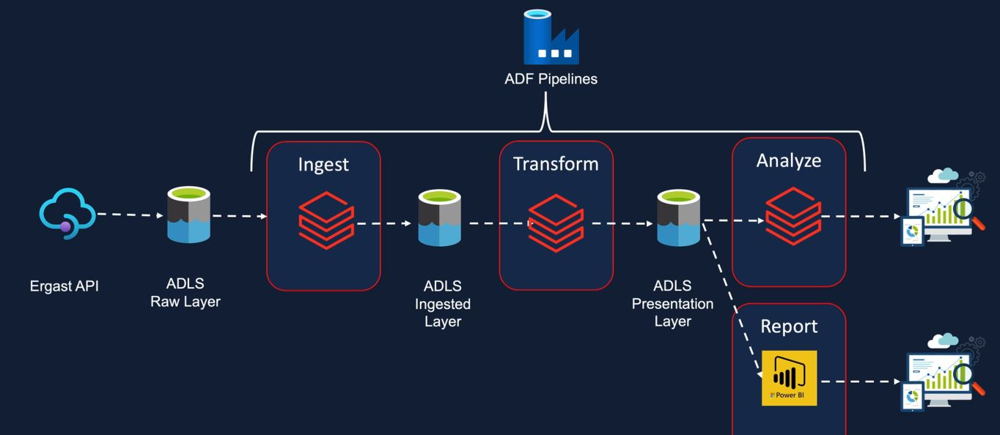
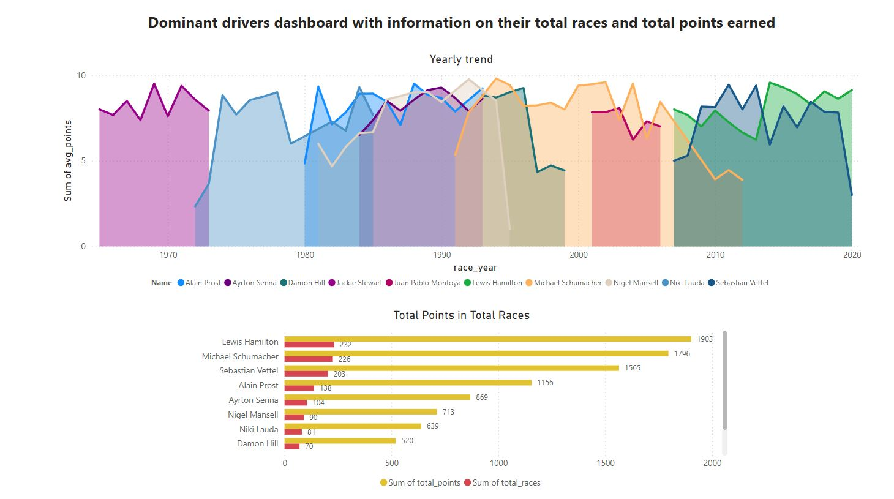

# Analyzing F1 Dominant Drivers and teams using Databricks (PySpark and SparkSQL)

What is this pipeline exactly doing?

1. Extracting F1 raw data from Ergast API.
2. Storing the raw data into an Azure data lake Gen2 containers
3. Transforming the data for Analytics using PySpark and store it in processed (silver) layer containers.
4. Load the transformed data into PowerBI to visualize insights for Dominant drivers and teams in F1.

## Architecture

1. **Ergast API**: Source of the F1 raw data.
2. **Spark**: Transforming all the data fetched from the API in Databricks using Pyspark and SparkSQL.
4. **PowerBI**: Visualization platform for the analytics ready data stored in the presentation (gold) layer.

## Dashboard

